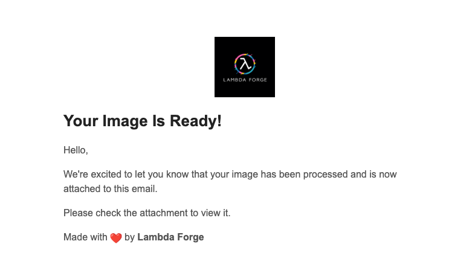

# Converting Image to QR Code with AWS S3, Secrets Manager and Email Notifications

In this part, we're going to cover how to make a function that turns images uploaded by users into QR codes. When a user sends a request, the image gets processed, saved on Amazon S3, and then sent to them via email so they can easily check out the results.


<p align="center">
  
</p>

## Incorporating S3 Into the Service Class

Let's start creating three distinct buckets, each dedicated to a specific stage: `Dev-Lambda-Forge-Images`, `Staging-Lambda-Forge-Images` and `Prod-Lambda-Forge-Images`.

<div class="admonition note">
<p class="admonition-title">Note</p>
<p>Keep in mind that your bucket name must be unique across all AWS regions. Therefore, you'll need to select distinct names for your project.</p>
</div>

Now place the arns on your `cdk.json`.

```python title="cdk.json" linenums="51" hl_lines="5 12 19"
   "dev": {
      "base_url": "https://api.lambda-forge.com/dev",
      "arns": {
        "urls_table": "$DEV-URLS-TABLE-ARN",
        "images_bucket": "$DEV-IMAGES-BUCKET-ARN"
      }
    },
    "staging": {
      "base_url": "https://api.lambda-forge.com/staging",
      "arns": {
        "urls_table": "$STAGING-URLS-TABLE-ARN",
        "images_bucket": "$STAGING-IMAGES-BUCKET-ARN"
      }
    },
    "prod": {
      "base_url": "https://api.lambda-forge.com",
      "arns": {
        "urls_table": "$PROD-URLS-TABLE-ARN",
        "images_bucket": "$PROD-IMAGES-BUCKET-ARN"
      }
    }
```

The next step involves integrating the S3 service into our service layer, facilitating direct communication with S3 buckets. To achieve this, execute the following command:

`forge service s3`

This command generates a new service file named `s3.py` within the infra/services directory, as illustrated below:

```hl_lines="8"
infra
└── services
    ├── __init__.py
    ├── api_gateway.py
    ├── aws_lambda.py
    ├── dynamodb.py
    ├── layers.py
    └── s3.py
```

Below showcases the updated structure of our Service class, now incorporating the S3 service, indicating the successful integration:

```python title="infra/services/__init__.py" hl_lines="14"
from infra.services.s3 import S3
from infra.services.dynamodb import DynamoDB
from infra.services.api_gateway import APIGateway
from infra.services.aws_lambda import AWSLambda
from infra.services.layers import Layers


class Services:
    def __init__(self, scope, context) -> None:
        self.api_gateway = APIGateway(scope, context)
        self.aws_lambda = AWSLambda(scope, context)
        self.layers = Layers(scope)
        self.dynamodb = DynamoDB(scope, context)
        self.s3 = S3(scope, context)
```

Here is the newly established S3 class:

```python title="infra/services/s3"
from aws_cdk import aws_s3 as s3
from aws_cdk import aws_s3_notifications
from lambda_forge.trackers import invoke, trigger


class S3:
    def __init__(self, scope, context) -> None:

        # self.s3 = s3.Bucket.from_bucket_arn(
        #     scope,
        #     "S3",
        #     bucket_arn=context.resources["arns"]["s3_arn"],
        # )
        ...

    @trigger(service="s3", trigger="bucket", function="function")
    def create_trigger(self, bucket, function, event=s3.EventType.OBJECT_CREATED):
        bucket = getattr(self, bucket)
        notifications = aws_s3_notifications.LambdaDestination(function)
        bucket.add_event_notification(event, notifications)
        bucket.grant_read(function)

    @invoke(service="s3", resource="bucket", function="function")
    def grant_write(self, bucket, function):
        bucket = getattr(self, bucket)
        bucket.grant_write(function)

```

As seen, Forge has created the class with a helper method to streamline the creation of a trigger between a bucket and a lambda function.

Let's update the class variables to directly reference our recently created bucket.

```python title="infra/services/s3.py" hl_lines="4-8" linenums="5"
class S3:
    def __init__(self, scope, context: dict) -> None:

        self.images_bucket = s3.Bucket.from_bucket_arn(
            scope,
            "ImagesBucket",
            bucket_arn=context.resources["arns"]["images_bucket"],
        )
```

Excellent! This approach configures our framework to utilize each ARN on its designated stage effectively.

## Incorporating Secrets Manager into the Services Class

Since we are dealing with emails, we must use usernames and passowrd. Hardcoding email credentials directly into the code exposes them to potential breaches. To mitigate this risk, we'll implement a more secure approach using AWS Secrets Manager, a service designed to safeguard sensitive information such as secret keys.

To create a new secrets manager service, simply type:

```
forge service secrets_manager
```

Similar to the S3 class, Forge will generate the new service file within the `infra/services` directory and seamlessly integrate it into the Services class.

```hl_lines="9"
infra
└── services
    ├── __init__.py
    ├── api_gateway.py
    ├── aws_lambda.py
    ├── dynamodb.py
    ├── layers.py
    ├── s3.py
    └── secrets_manager.py
```

Here's the newly established class:

```python title="infra/services/secrets_manager.py"
from aws_cdk import aws_secretsmanager as secrets_manager


class SecretsManager:
    def __init__(self, scope, resources) -> None:

        # self.secrets_manager = secrets_manager.Secret.from_secret_complete_arn(
        #     scope,
        #     id="SecretsManager",
        #     secret_complete_arn=resources["arns"]["secrets_manager_arn"],
        # )
        pass
```

Now, head over to the AWS Secrets Manager panel in the AWS console and create a new secret. Within this secret, store both the email address and an app password.

<div class="admonition warning">
  <p class="admonition-title">Warning</p>
<p>Note that you shouldn't save your regular GMAIL password; instead, use an app password. Refer to <a href="https://support.google.com/accounts/answer/185833?hl=en" target="_blank">Sign in with app passwords</a> to generate your app password.</p>
</div>

Now that we have the secret ARN in hand, let's proceed to update the Secrets Manager class accordingly.

```python title="infra/services/secrets_manager.py" linenums="4" hl_lines="4-8"
class SecretsManager:
    def __init__(self, scope, resources) -> None:

        self.gmail_secret = secrets_manager.Secret.from_secret_complete_arn(
            scope,
            id="GmailSecret",
            secret_complete_arn="$GMAIL-SECRET-ARN",
        )
```

## Using a Non-Public Library as Lambda Layer

To convert the image into a qr code, we are going to use an external library called `qrcode`. Unlike more popular layers, we're dealing with a library for which AWS doesn't provide a public layer.

## Creating an External Library in Lambda Forge

To create an external library in Lambda Forge, follow these steps:

1. Run the following command:
```sh
forge layer --external qrcode
```

2. Lambda Forge will automatically deploy this layer to AWS and print out the ARN of the layer.

3. Once you have the ARN of the layer, paste it into the `Layers` class.

```python title="infra/services/layers.py" hl_lines="8-12 14-18"
from aws_cdk import aws_lambda as _lambda
from lambda_forge import Path


class Layers:
    def __init__(self, scope) -> None:

        self.qrcode_layer = _lambda.LayerVersion.from_layer_version_arn(
            scope,
            id="QrCodeLayer",
            layer_version_arn="$QR-CODE-LAYER-ARN",
        )
```

It's essential to include both libraries in our `requirements.txt` file to ensure they are installed when deploying our application.

```title="requirements.txt" linenums="15"
qrcode==7.4.2
```

## Implementing the Function to Convert Image to QR Code

With our layers now set up, it's time to create our new function.

```
forge function qrcode --method "POST" --description "Converts an image into a qr code" --belongs-to "images" --no-tests --public --endpoint "images/qrcode"
```

We now have the following directory:

```
functions
└── images
    └── qrcode
        ├── __init__.py
        ├── config.py
        └── main.py
    
```

Let's dive into implementing this function, which will handle user input consisting of a `url` to convert the image parameter and an `email` parameter for sending notification.

```python title="functions/images/img_to_qrcode/main.py" linenums="1"
import hashlib
import json
import os
from dataclasses import dataclass
from io import BytesIO

import boto3
import qrcode


@dataclass
class Input:
    url: str
    email: str


@dataclass
class Output:
    pass


def lambda_handler(event, context):

    # Parse the input event to get the URL of the image and the S3 bucket name
    body = json.loads(event["body"])
    url = body.get("url")

    # Retrieve the S3 bucket name from environment variables
    bucket_name = os.environ.get("BUCKET_NAME")

    # Generate QR code from the image
    qr = qrcode.QRCode()
    qr.add_data(url)
    qr.make()

    # Create an image from the QR code
    qr_image = qr.make_image()

    # Convert the QR code image to bytes
    qr_byte_arr = BytesIO()
    qr_image.save(qr_byte_arr)
    qr_byte_arr = qr_byte_arr.getvalue()

    # Create the file name with a hash based on the input URL
    file_name = f"{hashlib.md5(url.encode()).hexdigest()}.jpg"

    # Initialize the S3 client
    s3_client = boto3.client("s3")

    # Upload the QR code image to S3
    s3_client.put_object(
        Bucket=bucket_name,
        Key=file_name,
        Body=qr_byte_arr,
        ContentType="image/png",
        Metadata={"url": url, "email": body.get("email")},
    )

    return {"statusCode": 200}
```

Essentially, our function retrieves the URL from the parameters provided by the user. It then utilizes the qrcode library to convert the URL into a QR code before storing it in the S3 bucket. Additionally, the function saves the original url along with the associated email as metadata for future reference.

Now, it's configuration.

```python title="functions/images/qrcode/config.py" hl_lines="12-15 20"
from infra.services import Services


class QrcodeConfig:
    def __init__(self, services: Services) -> None:

        function = services.aws_lambda.create_function(
            name="Qrcode",
            path="./functions/images",
            description="Converts an image into a qr code",
            directory="qrcode",
            layers=[services.layers.qrcode_layer],
            environment={
                "BUCKET_NAME": services.s3.images_bucket.bucket_name,
            },
        )

        services.api_gateway.create_endpoint("POST", "/images/qrcode", function, public=True)

        services.s3.grant_write("images_bucket", function)
```

## Implementing the Mailer Function

It's worth noting that in our previous implementation, we deliberately omitted email notifications. This exemplifies one of the advantages of serverless architecture: the ability to completely decouple functions from each other and initiate notifications through events.

This is precisely the approach we're taking with the mailer function. Whenever a file is uploaded to the S3 bucket, an event will be triggered to run this Lambda function. With the assistance of metadata, the mailer Lambda function will be equipped with the necessary information to determine the appropriate email recipients for notifications.

```
forge function mailer --description "Sends an email based on metadata when image enters the bucket" --belongs-to "images" --no-api --no-tests
```

Here's how our updated directory looks now.

```
functions
└── images
    ├── mailer
    │   ├── __init__.py
    │   ├── config.py
    │   └── main.py
    └── qrcode
        ├── __init__.py
        ├── config.py
        └── main.py
```

Let's whip up an eye-catching HTML layout to give our email a touch of elegance.

```html title="functions/images/mailer/template.html"
<html>
	<head>
		<style>
			body {
				font-family: Arial, sans-serif;
				margin: 0;
				padding: 0;
				background-color: #f4f4f4;
			}
			.container {
				background-color: #ffffff;
				margin: 10px auto;
				padding: 20px;
				max-width: 600px;
				border-radius: 8px;
				box-shadow: 0 4px 8px rgba(0, 0, 0, 0.1);
			}
			p {
				font-size: 16px;
				line-height: 1.5;
				color: #555555;
			}
			.logo {
				display: block;
				margin: 0 auto 20px auto;
				width: 100px;
				height: auto;
			}
		</style>
	</head>
	<body>
		<div class="container">
			
			<h1>Your Image Is Ready!</h1>
			<p>Hello,</p>
			<p>
				We're excited to let you know that your image has been processed and is
				now attached to this email.
			</p>

			<p>Please check the attachment to view it.</p>

			<p>
				Made with ❤️ by
				<b
					><a
						href="https://docs.lambda-forge.com"
						style="color: inherit; text-decoration: none;"
						>Lambda Forge</a
					></b
				>
			</p>
		</div>
	</body>
</html>
```

Time to implement the mailer functionality!

```python title="functions/images/mailer/main.py"
import os
import smtplib
from email.mime.application import MIMEApplication
from email.mime.multipart import MIMEMultipart
from email.mime.text import MIMEText

import boto3


def lambda_handler(event, context):
    # Initialize the S3 client
    s3_client = boto3.client("s3")

    # Fetch the SMTP details from the environment variables
    SMTP_HOST = os.environ["SMTP_HOST"]
    SMTP_PORT = os.environ["SMTP_PORT"]
    SMTP_USER = os.environ["SMTP_USER"]
    SMTP_PASS = os.environ["SMTP_PASS"]

    # Extract the bucket name and the object key from the event
    record = event["Records"][0]
    bucket_name = record["s3"]["bucket"]["name"]
    object_key = record["s3"]["object"]["key"]

    # Fetch the image from S3
    response = s3_client.get_object(Bucket=bucket_name, Key=object_key)

    # Extract the receiver email from the metadata
    receiver = response["Metadata"]["email"]

    # Create the multipart email
    msg = MIMEMultipart()
    sender_name = "Lambda Forge"

    # Set the 'From' field, including both the name and the email:
    msg["From"] = f"{sender_name} <{SMTP_USER}>"
    msg["To"] = receiver
    msg["Subject"] = "Image Processed Successfully!"

    # Join the current directory with the filename to get the full path of the HTML file
    current_directory = os.path.dirname(os.path.abspath(__file__))
    html_path = os.path.join(current_directory, "template.html")

    # Read the HTML content
    html = open(html_path).read()
    msg.attach(MIMEText(html, "html"))

    # Attach the image
    image_data = response["Body"].read()
    file_name = object_key.split("/")[-1]
    part = MIMEApplication(image_data, Name=file_name)
    part["Content-Disposition"] = f'attachment; filename="{file_name}"'
    msg.attach(part)

    # Send the email via Gmail's SMTP server, or use another server if not using Gmail
    with smtplib.SMTP_SSL(SMTP_HOST, SMTP_PORT) as server:
        server.login(SMTP_USER, SMTP_PASS)
        server.sendmail(SMTP_USER, receiver, msg.as_string())
```

This function fetches essential email-sending details from environment variables such as `SMTP_HOST`, `SMTP_PORT`, `SMTP_USER`, and `SMTP_PASS`. It then retrieves the recipient's email address from the bucket's metadata and sends an email with the QR code attached.

The elegance of this approach lies in its flexibility. We can incorporate multiple image processors, including tasks like image resizing, applying color filters, facial recognition, and more. None of these processors need to handle email sending directly. By simply saving the processed image inside the bucket, the corresponding functionality is seamlessly applied.

Now, let's configure our Mailer function.

```python title="functions/images/mailer/config.py" hl_lines="12-17 20-21"
from infra.services import Services


class MailerConfig:
    def __init__(self, services: Services) -> None:

        function = services.aws_lambda.create_function(
            name="Mailer",
            path="./functions/images",
            description="Sends an email when an image enters the bucket",
            directory="mailer",
            environment={
                "SMTP_HOST": "smtp.gmail.com",
                "SMTP_PORT": "465",
                "SMTP_USER": services.secrets_manager.gmail_secret.secret_value_from_json("email").unsafe_unwrap(),
                "SMTP_PASS": services.secrets_manager.gmail_secret.secret_value_from_json("password").unsafe_unwrap(),
            },
        )

        services.s3.images_bucket.grant_read(function)
        services.s3.create_trigger("images_bucket", function)
```

With our existing setup, we configure the environment variables and grant read permissions to the function for accessing the bucket. Additionally, we utilize Forge's helper method to establish a trigger that activates when an object is created in the bucket, invoking the function.

## Mitigating Security Risks in Mailer Configuration

Although the `/mailer/config.py` file may seem functional, its implementation poses a significant security risk. Hardcoding credentials directly into environment variables exposes them to potential breaches, as the secret will be visible on the Lambda Function panel.


To mitigate this risk, let's modify our `main.py` file slightly. Instead of retrieving the Gmail credentials from environment variables, we'll directly retrieve them from AWS Secrets Manager.

```python title="functions/images/mailer/main.py" linenums="11" hl_lines="9-21"
def lambda_handler(event, context):
    # Initialize the S3 client
    s3_client = boto3.client("s3")

    # Fetch the SMTP details from the environment variables
    SMTP_HOST = os.environ["SMTP_HOST"]
    SMTP_PORT = os.environ["SMTP_PORT"]

    import json

    # Initialize the Secrets Manager client
    sm_client = boto3.client('secretsmanager')
    secret_name = '$SECRET-NAME'

    # Retrieve the secret value from Secrets Manager
    response = sm_client.get_secret_value(SecretId=secret_name)
    secret = json.loads(response['SecretString'])

    # Extract SMTP credentials from the secret data
    SMTP_USER = secret["email"]
    SMTP_PASS = secret["password"]
```

That's quite a bit of boilerplate code for such a straightforward task! 😰 Considering the critical importance of security, we'll probably employ this code snippet in numerous functions.

### Creating a Custom Layer to Avoid Code Duplication

To avoid duplicating the previous code throughout our project, let's establish a new `sm_utils` custom layer. This approach will streamline the process, allowing all lambda functions that need to retrieve a secret from Secrets Manager to do so with just a single line of code.

Check out [AWS Lambda Development with Custom Layers](https://docs.lambda-forge.com/home/page5/#aws-lambda-development-with-custom-layers) to delve deeper into custom layers in Lambda development.

To create the new custom layer, simply type:

```
forge layer --custom sm_utils
```

This command creates the following directory:

```
layers
├── __init__.py
└── sm_utils
    ├── __init__.py
    └── sm_utils.py
```

Additionally, a new layer has been incorporated into the Layers class.

```python title="infra/services/layers" linenums="5" hl_lines="7-13"
        self.qrcode_layer = _lambda.LayerVersion.from_layer_version_arn(
            scope,
            id="QrCodeLayer",
            layer_version_arn="arn:aws:lambda:us-east-2:211125768252:layer:QRCode:1",
        )

        self.sm_utils_layer = _lambda.LayerVersion(
            scope,
            id='SmUtilsLayer',
            code=_lambda.Code.from_asset(Path.layer('layers/sm_utils')),
            compatible_runtimes=[_lambda.Runtime.PYTHON_3_9],
            description='',
         )
```

Now, it's time to level up the sm_utils layer by introducing a `get_secret` function. This handy feature will be shared across all our Lambda functions, simplifying our codebase.

```python title="layers/sm_utils/sm_utils.py"
import json

import boto3


def get_secret(secret_name: str):

    # Initialize the Secrets Manager client
    sm_client = boto3.client("secretsmanager")

    # Retrieve the secret value from Secrets Manager
    response = sm_client.get_secret_value(SecretId=secret_name)

    # Handle scenarios where the secret is stored as plain text instead of JSON.
    try:
        secret = json.loads(response["SecretString"])

    except json.JSONDecodeError:
        secret = response["SecretString"]

    return secret
```

### Refactoring The Mailer Function to Use Custom Layers

Below is the updated `main.py` file, now leveraging the new `sm_utils` layer.

```python title="functions/images/mailer/main.py" hl_lines="8 23"
import os
import smtplib
from email.mime.application import MIMEApplication
from email.mime.multipart import MIMEMultipart
from email.mime.text import MIMEText

import boto3
import sm_utils


def lambda_handler(event, context):
    # Initialize the S3 client
    s3_client = boto3.client("s3")

    # Fetch the SMTP details from the environment variables
    SMTP_HOST = os.environ["SMTP_HOST"]
    SMTP_PORT = os.environ["SMTP_PORT"]

    # Get the secret name from env variable
    SECRET_NAME = os.environ["SECRET_NAME"]

    # Get the secret from sm_utils layer
    secret = sm_utils.get_secret(SECRET_NAME)

    SMTP_USER = secret["email"]
    SMTP_PASS = secret["password"]

    # Extract the bucket name and the object key from the event
    record = event["Records"][0]
    bucket_name = record["s3"]["bucket"]["name"]
    object_key = record["s3"]["object"]["key"]

    # Fetch the image from S3
    response = s3_client.get_object(Bucket=bucket_name, Key=object_key)

    # Extract the receiver email from the metadata
    receiver = response["Metadata"]["email"]

    # Create the multipart email
    msg = MIMEMultipart()
    sender_name = "Lambda Forge"

    # Set the 'From' field, including both the name and the email:
    msg["From"] = f"{sender_name} <{SMTP_USER}>"
    msg["To"] = receiver
    msg["Subject"] = "Image Processed Successfully!"

    # Join the current directory with the filename to get the full path of the HTML file
    current_directory = os.path.dirname(os.path.abspath(__file__))
    html_path = os.path.join(current_directory, "template.html")

    # Read the HTML content
    html = open(html_path).read()
    msg.attach(MIMEText(html, "html"))

    # Attach the image
    image_data = response["Body"].read()
    file_name = object_key.split("/")[-1]
    part = MIMEApplication(image_data, Name=file_name)
    part["Content-Disposition"] = f'attachment; filename="{file_name}"'
    msg.attach(part)

    # Send the email via Gmail's SMTP server, or use another server if not using Gmail
    with smtplib.SMTP_SSL(SMTP_HOST, SMTP_PORT) as server:
        server.login(SMTP_USER, SMTP_PASS)
        server.sendmail(SMTP_USER, receiver, msg.as_string())
```

Now, let's adjust the configuration to accommodate the changes necessary for the function.

```python title="functions/images/mailer/config.py" hl_lines="12 16 23"
from infra.services import Services


class MailerConfig:
    def __init__(self, services: Services) -> None:

        function = services.aws_lambda.create_function(
            name="Mailer",
            path="./functions/images",
            description="Sends an email when an image enters the bucket",
            directory="mailer",
            layers=[services.layers.sm_utils_layer],
            environment={
                "SMTP_HOST": "smtp.gmail.com",
                "SMTP_PORT": "465",
                "SECRET_NAME": services.secrets_manager.gmail_secret.secret_name,
            },
        )

        services.s3.images_bucket.grant_read(function)
        services.s3.create_trigger("images_bucket", function)

        services.secrets_manager.gmail_secret.grant_read(function)
```

## Deploying The Functions

Next, we'll commit our code and push it to GitHub, following these steps:

```bash
# Send your changes to stage
git add .

# Commit with a descriptive message
git commit -m "Image to QR code converter with result being sent by email"

# Push changes to the 'dev' branch
git push origin dev

# Merge 'dev' into 'staging' and push
git checkout staging
git merge dev
git push origin staging

# Finally, merge 'staging' into 'main' and push
git checkout main
git merge staging
git push origin main
```

This process guarantees that our code transitions systematically through the development, staging, and production environments. It activates our three specialized deployment pipelines, as illustrated by the pipelines running in the accompanying image.


Following the successful execution of these pipelines, the Image to QR code feature becomes accessible across the development, staging, and production stages, ensuring a seamless deployment.

## Testing the Image to QR Code Conversion

We'll walk through testing our Image to QR Code Converter, focusing on the production environment for this demonstration. The procedure remains consistent across development and staging environments, with the only difference being the specific endpoints used.

To convert an image URL into a QR code, we execute the following POST request:

```bash
curl --request POST \
  --url https://api.lambda-forge.com/images/qrcode \
  --header 'Content-Type: application/json' \
  --data '{
	"url": "https://public-lambda-forge-logo.s3.us-east-2.amazonaws.com/wNSN2U7n9NiAKEItWlsrcdJ0RWFyZOmbNvsc6Kht84WsWVxuBz5O.png",
	"email": "$EMAIL"
}'
```

Shortly after the request is made, an email is dispatched to the provided address.


The email contains a QR code attachment, as seen in the illustration below:

<p align="center">
  
</p>

Upon scanning the QR code, the original image is displayed:


🎉 Success! The Image to QR Code Converter function is now fully deployed and operational in all environments. 🚀✨
