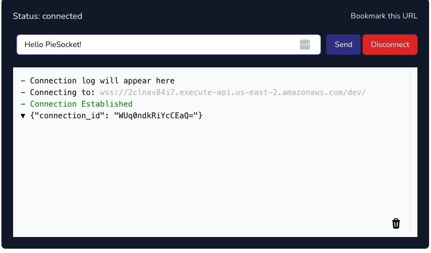
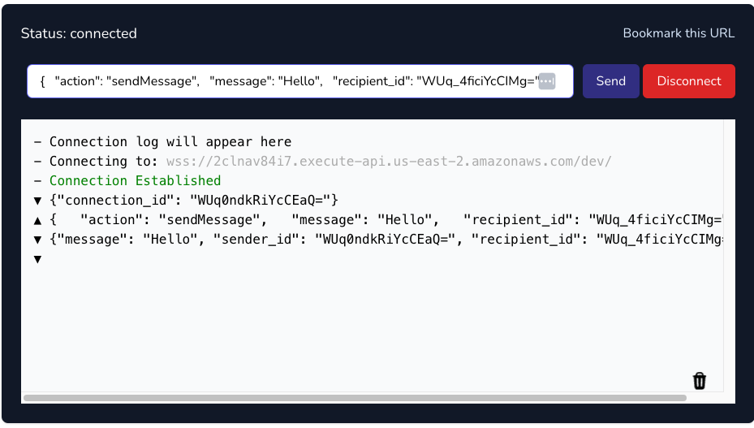

# Building a Real-Time Chat Application with WebSockets in a Serverless Architecture

In this section, we will develop a real-time chat application using WebSockets, facilitating instant communication. This solution is versatile and can be adapted to different scenarios that require fast, real-time interactions, such as the live chat application shown below.

The architecture for the Lambda functions we are going to implement will be as follows:

<p align="center">
  
</p>

## Incorporating the Websockets Class into the Services Class

Traditionally, integrating WebSockets involves a significant amount of setup, including configuring the API and establishing various routes to initiate a connection. Fortunately, Forge simplifies this process considerably by offering a template where the connections are pre-configured and interconnected.

```
forge service websockets
```

This command creates a new file within the `infra/services` directory specifically for managing Websocket connections.

```hl_lines="11"
infra
└── services
    ├── __init__.py
    ├── api_gateway.py
    ├── aws_lambda.py
    ├── dynamodb.py
    ├── kms.py
    ├── layers.py
    ├── s3.py
    ├── secrets_manager.py
    └── websockets.py
```

This class is crafted to simplify the traditionally complex process of creating, deploying, and integrating WebSocket APIs. It not only streamlines the setup but also manages the necessary permissions, enabling functions to seamlessly send messages through a WebSocket channel.

To ease the configuration and management of WebSockets, we utilize the open-source library `b_aws_websocket_api`, enhancing our integration capabilities and efficiency.

## Setup the Websocket URLS for a Multi-Stage Environment

Before we proceed, it's important to note a key consideration. Similar to the [URL Shortener]() project, our Lambda operates in a multi-staging environment. This setup requires unique WebSocket URLs for each stage to ensure proper functionality. To manage this, we must specify these distinct URLs in the `cdk.json` file, assigning a unique URL to each stage accordingly.

<div class="admonition note">
    <p class="admonition-title">Note</p>
    <p>If you have configured a custom domain name, you can preemptively specify your URLs. If not, you will need to deploy your code to AWS to obtain the WebSocket URLs. Subsequently, these URLs must be added to the cdk.json file.</p>
</div>

```python title="cdk.json" linenums="51" hl_lines="3 12 21"
   "dev": {
      "base_url": "https://api.lambda-forge.com/dev",
      "post_to_connection_url": "$DEV-POST-TO-CONNECTION-URL",
      "arns": {
        "urls_table": "$DEV-URLS-TABLE-ARN",
        "images_bucket": "$DEV-IMAGES-BUCKET-ARN",
        "auth_table": "$DEV-AUTH-TABLE-ARN"
      }
    },
    "staging": {
      "base_url": "https://api.lambda-forge.com/staging",
      "post_to_connection_url": "$STAGING-POST-TO-CONNECTION-URL",
      "arns": {
        "urls_table": "$STAGING-URLS-TABLE-ARN",
        "images_bucket": "$STAGING-IMAGES-BUCKET-ARN",
        "auth_table": "$STAGING-AUTH-TABLE-ARN"
      }
    },
    "prod": {
      "base_url": "https://api.lambda-forge.com",
      "post_to_connection_url": "$PROD-POST-TO-CONNECTION-URL",
      "arns": {
        "urls_table": "$PROD-URLS-TABLE-ARN",
        "images_bucket": "$PROD-IMAGES-BUCKET-ARN",
        "auth_table": "$PROD-AUTH-TABLE-ARN"
      }
    }
```

## Establishing a Connection with the Websocket

To identify the connection IDs for each WebSocket channel, it's essential to inform the client of our application about their respective IDs. This step ensures we can accurately locate the channels as they begin to exchange messages.

Within the AWS environment, we face a specific constraint that we must adhere to: ==We cannot directly send messages to a WebSocket channel from the Lambda function that handles the connection.==

Therefore, we must implement a sequential two-part process. The initial Lambda function, assigned to handle the connection setup, will trigger another Lambda function. This second function is specifically designed with the capability to send messages directly through the WebSocket channel.

### Creating the Function to Send the Connection IDs

Let's first create the function that will actually send the connection id.

```
forge function send_connection_id --description "Sends the connection id to the client when a connection is made" --belongs-to "chat" --no-tests
```

This command creates a new `send_connection_id` function within the `chat` directory.

```
functions
└── chat
    ├── __init__.py
    └── send_connection_id
        ├── __init__.py
        ├── config.py
        └── main.py
```

This function is going to be very simple, it should simply receive an event with the connection id and send a message to the desired websocket channel.

```python title="functions/chat/send_connection_id/main.py"
import json
import os
import boto3


def lambda_handler(event, context):

    # Retrieve the connection ID from the event
    connection_id = event["connection_id"]

    # Create a client for the API Gateway Management API
    api_gateway_management_client = boto3.client(
        "apigatewaymanagementapi", endpoint_url=os.environ.get("POST_TO_CONNECTION_URL")
    )

    # Send the payload to the WebSocket
    api_gateway_management_client.post_to_connection(
        ConnectionId=connection_id, Data=json.dumps({"connection_id": connection_id}).encode("utf-8")
    )

    return {"statusCode": 200}
```

<div class="admonition warning">
    <p class="admonition-title">Warning</p>
    <p>When working with WebSockets, it's crucial to return the status code in your responses. Failing to do so may lead to errors in your application.</p>
</div>

We need to implement a minor adjustment to the Lambda stack, ensuring it passes the context to the `SendConnectionIdConfig` class. This modification allows the function to dynamically determine the appropriate environment for message delivery.

```python title="infra/stacks/lambda_stack.py" linenums="50" hl_lines="2"
        # Chat
        SendConnectionIdConfig(self.services, context)
```

Now, Let's configure it.

```python title="functions/chat/send_connection_id/config.py" hl_lines="6 13-15 18-23"
from infra.services import Services
from aws_cdk import aws_iam as iam


class SendConnectionIdConfig:
    def __init__(self, services: Services, context) -> None:

        function = services.aws_lambda.create_function(
            name="SendConnectionId",
            path="./functions/chat",
            description="Sends the connection id to the client when a connection is made",
            directory="send_connection_id",
            environment={
              "POST_TO_CONNECTION_URL": context.resources["post_to_connection_url"]
            },
        )

        function.add_to_role_policy(
            iam.PolicyStatement(
                actions=["execute-api:ManageConnections"],
                resources=["arn:aws:execute-api:*:*:*"],
            )
        )
```

### Creating the Function to Handle the Websocket Connections

With the function for sending the connections id now established, let's proceed to set up the connection handler.

```
forge function connect --description "Handle the websocket connection" --websocket --belongs-to "chat" --no-tests
```

As expected, a new function has been created on the `chat` directory.

```
functions
└── chat
    ├── __init__.py
    ├── connect
    │   ├── __init__.py
    │   ├── config.py
    │   └── main.py
    └── send_connection_id
       ├── __init__.py
       ├── config.py
       └── main.py
```

Let's move forward with its straightforward implementation, which will essentially involve invoking another function and passing along the connection ID.

```python title="functions/chat/connect/main.py"
import json
import os
import boto3


def lambda_handler(event, context):

    # Retrieve the connection ID from the request context
    connection_id = event["requestContext"]["connectionId"]

    # Create a client for the AWS Lambda service
    lambda_client = boto3.client("lambda")

    # Retrieve the ARN of the target Lambda function from the environment variables
    TARGET_FUNCTION_ARN = os.environ.get("TARGET_FUNCTION_ARN")

    # Define the payload to pass to the target Lambda function
    payload = {"connection_id": connection_id}

    # Invoke the target Lambda function asynchronously
    lambda_client.invoke(FunctionName=TARGET_FUNCTION_ARN, InvocationType="Event", Payload=json.dumps(payload))

    return {"statusCode": 200}
```

This function has a crucial dependency on another, requiring precise configuration to grant it the necessary permissions for invoking the target function and to correctly obtain its ARN.

To manage such scenarios, the `AWSLambda` class maintains references to all functions it creates. This approach ensures these functions remain accessible for future interactions.


With this context in mind, let's proceed to set up the connection handler.

```python title="functions/chat/connect/config.py" hl_lines="7 14-16 19 21"
from infra.services import Services


class ConnectConfig:
    def __init__(self, services: Services) -> None:

        send_connection_id_function = services.aws_lambda.functions["SendConnectionId"]

        connect_function = services.aws_lambda.create_function(
            name="Connect",
            path="./functions/chat",
            description="Handle the websocket connection",
            directory="connect",
            environment={
                "TARGET_FUNCTION_ARN": send_connection_id_function.function_arn,
            },
        )

        services.websockets.create_route("$connect", connect_function)

        send_connection_id_function.grant_invoke(connect_function)
```

To ensure the `SendConnectionId` function is available in the configuration for the `Connect` function, it's crucial to define the target function before creating the trigger function.

The order in which functions are generated and become operational is directly tied to their definition sequence within the `LambdaStack`. Hence, it is imperative to ensure the sequence is correctly arranged, with the target function being established before its corresponding trigger function.

```python title="infra/stacks/lambda_stack.py" linenums="50"
        # Chat
        SendConnectionIdConfig(self.services, context)
        ConnectConfig(self.services)
```

## Sending Messages

Once a connection is established, we can be sending messages in real time to each channel. So let's create the function that will send the messages.

```
forge function send_message --description "Send messages to sender and recipient" --websocket --belongs-to "chat" --no-tests
```

Below is the updated layout of our folder structure.

```
functions
└── chat
    ├── connect
    │   ├── __init__.py
    │   ├── config.py
    │   └── main.py
    ├── send_connection_id
    │   ├── __init__.py
    │   ├── config.py
    │   └── main.py
    └── send_message
        ├── __init__.py
        ├── config.py
        └── main.py
```

Like the previous functions, this one will be very simple. It will accept a connection ID for posting messages, using the channel ID as the sender ID. Additionally, it will forward the same messages to both channels, ensuring that clients can maintain a message history across both channels.

```python title="functions/chat/send_message/main.py"
import json
import os
import boto3


def lambda_handler(event, context):

    # Retrieve the URL for posting messages to connected clients from the environment variables
    POST_TO_CONNECTION_URL = os.environ.get("POST_TO_CONNECTION_URL")

    # Create a client for the API Gateway Management API, specifying the endpoint URL
    apigtw_management = boto3.client(
        "apigatewaymanagementapi",
        endpoint_url=POST_TO_CONNECTION_URL,
    )

    # Retrieve the connection ID of the sender from the request context
    sender_id = event["requestContext"]["connectionId"]

    # Parse the incoming message and the recipient ID from the Lambda event body
    message = json.loads(event["body"])["message"]
    recipient_id = json.loads(event["body"])["recipient_id"]

    # Iterate over both the sender and recipient connection IDs
    for connection_id in [sender_id, recipient_id]:
        apigtw_management.post_to_connection(
            ConnectionId=connection_id,
            Data=json.dumps({"message": message, "sender_id": sender_id, "recipient_id": recipient_id}),
        )

    return {"statusCode": 200}
```

Similar to the `SendConnectionId` function, it's necessary to pass the context from the `LambdaStack` to the `SendMessageConfig` class. This step enables our function to discern the appropriate stage for message dispatch.

```python title="infra/stacks/lambda_stack.py" linenums="50" hl_lines="2"
        # Chat
        SendMessageConfig(self.services, context)
        SendConnectionIdConfig(self.services, context)
        ConnectConfig(self.services)
```

Having the context available, we can now configure the send message function.

```python title="functions/chat/send_message/config.py" hl_lines="6 13-15 18 20-25"
from infra.services import Services
from aws_cdk import aws_iam as iam


class SendMessageConfig:
    def __init__(self, services: Services, context) -> None:

        function = services.aws_lambda.create_function(
            name="SendMessage",
            path="./functions/chat",
            description="Send messages to sender and recipient",
            directory="send_message",
            environment={
                "POST_TO_CONNECTION_URL": context.resources["post_to_connection_url"],
            },
        )

        services.websockets.create_route("sendMessage", function)

        function.add_to_role_policy(
            iam.PolicyStatement(
                actions=["execute-api:ManageConnections"],
                resources=[f"arn:aws:execute-api:*:*:*"],
            )
        )
```

## Deploying the Functions

Next, we'll commit our code and push it to GitHub, following these steps:

```bash
# Send your changes to stage
git add .

# Commit with a descriptive message
git commit -m "Serverless Real-Time Chat Application"

# Push changes to the 'dev' branch
git push origin dev

# Merge 'dev' into 'staging' and push
git checkout staging
git merge dev
git push origin staging

# Finally, merge 'staging' into 'main' and push
git checkout main
git merge staging
git push origin main
```

This sequence guarantees that our code progresses through the development, staging, and ultimately, the production environments, triggering our three separate deployment pipelines in the process.


Upon completion of these pipelines, the Real Time Chat will be operational across the development, staging, and production stages.

## Testing the Functions

To thoroughly test our real-time application, we'll connect to a WebSocket client. While there are numerous clients available for testing WebSockets, we'll utilize PieSocket's WebSocket tester, available at [PieSocket WebSocket Tester](https://www.piesocket.com/websocket-tester).

The URL we will use to test our application corresponds to the development stage, as detailed below:

[wss://2clnav84i7.execute-api.us-east-2.amazonaws.com/dev/](wss://2clnav84i7.execute-api.us-east-2.amazonaws.com/dev/)

### Step 1: Establish a WebSocket Connection

Navigate to the PieSocket tester and enter the URL of your WebSocket connection. This URL is typically generated after deploying your WebSocket service.


Upon successfully connecting, the WebSocket service will respond with the connection ID.



### Step 2: Create a Second Connection

Open a new tab or window and repeat the connection steps to establish a second WebSocket client.


You'll notice each connection has a unique ID. These IDs are crucial for directing messages to the correct recipient.

### Step 3: Test Messaging Between Connections

Choose one tab as the sender and use the other's connection ID as the recipient. You can send a message by inputting a JSON payload like the one below, substituting `$CONNECTION_ID` with the actual connection ID of the recipient:

```json
{
  "action": "sendMessage",
  "message": "Hello",
  "recipient_id": "$CONNECTION_ID"
}
```

If everything is configured correctly, you should observe the message appearing in real-time on both channels!




🎉 Congratulations! You've now successfully developed a Serverless Real-Time Chat application using WebSockets and Lambda Forge. 💬 🌐
