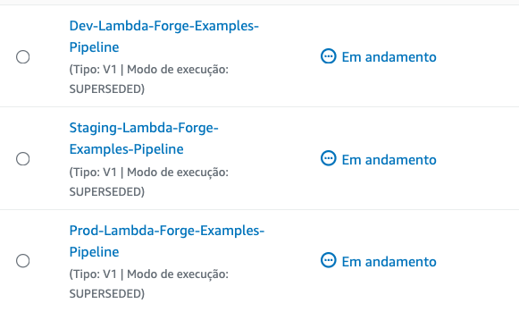

# Creating a URL Shortener Service Using DynamoDB

In this section, we will explore the development of a URL shortener. This utility enables users to input a lengthy URL, which the system then compresses into a more concise version.

The setup for the Lambda functions we aim to develop will follow this structure:

<p align="center">
  
</p>

## Setting Up the DynamoDB Tables

To begin, create three separate DynamoDB tables in the AWS Console to store URLs for different environments: `Dev-URLs`, `Staging-URLs`, and `Prod-URLs`.

Next, open your project’s `cdk.json` file and incorporate the tables ARNs into the respective environment configurations. This setup ensures that each environment interacts only with its designated table, maintaining clear separation and organization.

```json title="cdk.json" linenums="51" hl_lines="4 10 16"
    "dev": {
      "arns": {
        "numbers_table": "$DEV-NUMBERS-TABLE-ARN",
        "urls_table": "$DEV-URLS-TABLE-ARN",
      }
    },
    "staging": {
      "arns": {
        "numbers_table": "$STAGING-NUMBERS-TABLE-ARN",
        "urls_table": "$STAGING-URLS-TABLE-ARN",
      }
    },
    "prod": {
      "arns": {
        "numbers_table": "$PROD-NUMBERS-TABLE-ARN",
        "urls_table": "$PROD-URLS-TABLE-ARN",
      }
    }
```

Next, we need to create a new variable class within the DynamoDB class to reference our URLs tables.

```python title="infra/services/dynamodb.py" hl_lines="10-14" linenums="5"
class DynamoDB:
    def __init__(self, scope, context: dict) -> None:

        self.numbers_table = dynamodb.Table.from_table_arn(
            scope,
            "NumbersTable",
            context.resources["arns"]["numbers_table"],
        )

        self.urls_table = dynamodb.Table.from_table_arn(
            scope,
            "URLsTable",
            context.resources["arns"]["urls_table"],
        )
```

## Implementing the Shortener Function

To initiate, let's develop the shortener function, which serves as the primary interface for user interaction. This function is tasked with accepting a lengthy URL from the user and providing them with its shortened counterpart in response:

```
forge function shortener --method "POST" --description "Creates a new short URL entry in DynamoDB mapped to the original one" --belongs-to urls --public --no-tests
```

Executing the command will result in the establishment of the following directory structure:

```
functions
└── urls
    └──  shortener
       ├── __init__.py
       ├── config.py
       └──  main.py
```

Now, let's implement it's functionality:

```python title="functions/urls/shortener/main.py" linenums="1"
from dataclasses import dataclass
import hashlib
import json
import os
import boto3

@dataclass
class Input:
    url: str


@dataclass
class Output:
    short_url: str


def lambda_handler(event, context):
    # Retrieve DynamoDB table name and the Base URL from environment variables.
    URLS_TABLE_NAME = os.environ.get("URLS_TABLE_NAME")
    BASE_URL = os.environ.get("BASE_URL")

    # Initialize DynamoDB resource.
    dynamodb = boto3.resource("dynamodb")

    # Reference the specified DynamoDB table.
    urls_table = dynamodb.Table(URLS_TABLE_NAME)

    # Parse the URL from the incoming event's body.
    body = json.loads(event["body"])
    original_url = body["url"]

    # Generate a URL hash.
    hash_object = hashlib.sha256(original_url.encode())
    url_id = hash_object.hexdigest()[:6]

    # Store the mapping in DynamoDB.
    urls_table.put_item(Item={"PK": url_id, "original_url": original_url})

    # Construct the shortened URL.
    short_url = f"{BASE_URL}/{url_id}"

    # Return success response.
    return {"statusCode": 200, "body": json.dumps({"short_url": short_url})}
```

This code is the core of our URL shortening service. It transforms long URLs into shorter, hash-based versions, and storing this information in DynamoDB for future retrieval.

Since we are operating in a multi-stage environment, this function is dynamically retrieving the BASE URL from environment variables, as shown on line 20. This approach ensures stage-specific responses, enabling seamless URL customization.

To make this possible, we must incorporate the base URL into the `cdk.json` file and implement minor modifications. These adjustments will enable the base URL to be accessible within the `config.py` class, thereby allowing the function to access the appropriate base URL depending on the environment it's operating in.

```json title="cdk.json" linenums="51" hl_lines="2 9 16"
    "dev": {
      "base_url": "https://api.lambda-forge.com/dev",
      "arns": {
        "numbers_table": "$DEV-NUMBERS-TABLE-ARN",
        "urls_table": "$DEV-URLS-TABLE-ARN"
      }
    },
    "staging": {
      "base_url": "https://api.lambda-forge.com/staging",
      "arns": {
        "numbers_table": "$STAGING-NUMBERS-TABLE-ARN",
        "urls_table": "$STAGING-URLS-TABLE-ARN"
      }
    },
    "prod": {
      "base_url": "https://api.lambda-forge.com",
      "arns": {
        "numbers_table": "$PROD-NUMBERS-TABLE-ARN",
        "urls_table": "$PROD-URLS-TABLE-ARN"
      }
    }
```

<div class="admonition note">
<p class="admonition-title">Note</p>
<p>
Follow the article <a href="https://docs.lambda-forge.com/articles/locating-the-base-url/">Locating The Api Gateway Base URL on CloudFormation</a> to locate your own base URL in each environment.
</p>
</div>

Initially, the `LambdaStack` class sends only the `self.services` as argument to the `ShortenerConfig` class. We must update it to also send the `context` parameter. This change allows the config class to access base URLs and dynamically set the correct environment variables during the function definition, enhancing its adaptability.

```python title="infra/stacks/lambda_stack.py" hl_lines="13" linenums="19"
class LambdaStack(Stack):
    def __init__(self, scope: Construct, context, **kwargs) -> None:

        super().__init__(scope, f"{context.name}-Lambda-Stack", **kwargs)

        self.services = Services(self, context)

        # GuessTheNumber
        MakeGuessConfig(self.services)
        CreateGameConfig(self.services)

        # Urls
        ShortenerConfig(self.services, context)
```

To conclude, we will now proceed with configuring our Lambda function.

```python title="functions/urls/config.py" hl_lines="4 11-14 19"
from infra.services import Services

class ShortenerConfig:
    def __init__(self, services: Services, context) -> None:

        function = services.aws_lambda.create_function(
            name="Shortener",
            path="./functions/urls",
            description="Creates a new short URL entry in DynamoDB mapping to the original url",
            directory="shortener",
            environment={
                "URLS_TABLE_NAME": services.dynamodb.urls_table.table_name,
                "BASE_URL": context.resources["base_url"],
            },
        )

        services.api_gateway.create_endpoint("POST", "/urls", function, public=True)

        services.dynamodb.grant_write("numbers_table", function)
```

In this configuration, we specify resources according to the deployment stages of the Lambda function, setting up the DynamoDB table and API Gateway base URL accordingly. It also includes permission settings, enabling the Lambda function to write to our DynamoDB table.

## Implementing the Redirect Function

Having established the necessary components for URL shortening, we now proceed to create a new function tasked with redirecting users from the shortened URL to its original counterpart.

Begin by creating a new function:

```
forge function redirect --method "GET" --description "Redirects from the short url to the original url" --belongs-to urls --public --no-tests
```

The revised directory structure will appear as follows:

```
functions
└── urls
    ├── redirect
    │   ├── __init__.py
    │   ├── config.py
    │   └── main.py
    └── shortener
        ├── __init__.py
        ├── config.py
        └── main.py
```

Now, let's implement the redirect functionality.

```python title="functions/urls/redirect/main.py"
from dataclasses import dataclass
import json
import boto3
import os


@dataclass
class Path:
    url_id: str


@dataclass
class Input:
    pass


@dataclass
class Output:
    pass


def lambda_handler(event, context):

    # Retrieve DynamoDB table name from environment variables.
    URLS_TABLE_NAME = os.environ.get("URLS_TABLE_NAME")

    # Initialize DynamoDB resource and table reference.
    dynamodb = boto3.resource("dynamodb")
    urls_table = dynamodb.Table(URLS_TABLE_NAME)

    # Extract shortened URL identifier from path parameters.
    short_url = event["pathParameters"]["url_id"]

    # Retrieve the original URL using the shortened identifier.
    response = urls_table.get_item(Key={"PK": short_url})
    original_url = response.get("Item", {}).get("original_url")

    # Return 404 if no URL is found for the identifier.
    if original_url is None:
        return {"statusCode": 404, "body": json.dumps({"message": "URL not found"})}

    # Ensure URL starts with "http://" or "https://".
    if not original_url.startswith("http"):
        original_url = f"http://{original_url}"

    # Redirect to the original URL with a 301 Moved Permanently response.
    return {"statusCode": 301, "headers": {"Location": original_url}}
```

In this Lambda function, we're essentially setting up a redirect service. When a request comes in with a short URL identifier, the function looks up this identifier in the DynamoDB table to find the corresponding original URL. If found, it redirects the user to the original URL.

Next, let's move on to its configuration.

```python title="functions/urls/redirect/config.py" hl_lines="12-14 19"
from infra.services import Services


class RedirectConfig:
    def __init__(self, services: Services) -> None:

        function = services.aws_lambda.create_function(
            name="Redirect",
            path="./functions/urls",
            description="Redirects from the short url to the original url",
            directory="redirect",
            environment={
                "URLS_TABLE_NAME": services.dynamodb.urls_table.table_name,
            }
        )

        services.api_gateway.create_endpoint("GET", "/{url_id}", function, public=True)

        services.dynamodb.urls_table.grant_read_data(function)
```

## Deploying the Functions

Next, we'll commit our code and push it to GitHub, following these steps:

```bash
# Send your changes to stage
git add .

# Commit with a descriptive message
git commit -m "URL Shortener with DynamoDB integration"

# Push changes to the 'dev' branch
git push origin dev

# Merge 'dev' into 'staging' and push
git checkout staging
git merge dev
git push origin staging

# Finally, merge 'staging' into 'main' and push
git checkout main
git merge staging
git push origin main
```

This sequence ensures our code passes through development, staging, and finally, production environments, activating our three distinct deployment pipelines.



After the pipelines complete, the URL Shortener feature is available across development, staging, and production stages.

## Testing The Deployment

Let's test our URL Shortener by shortening a lengthy URL. For demonstration purposes, we'll use the production environment, but the process remains identical for development and staging, using their respective endpoints.

Execute a POST request to shorten the URL:

```bash
curl --request POST \
  --url https://api.lambda-forge.com/urls \
  --header 'Content-Type: application/json' \
  --header 'accept: application/json' \
  --data '{
	"url": "https://public-lambda-forge-logo.s3.us-east-2.amazonaws.com/wNSN2U7n9NiAKEItWlsrcdJ0RWFyZOmbNvsc6Kht84WsWVxuBz5O.png"
}'
```

This request generates a short URL:

```json
{
  "short_url": "https://api.lambda-forge.com/bc23d3"
}
```

Navigating to this URL in your browser will redirect you to the original content, showcasing our URL Shortener in action.


🎉 Success! Our URL shortener function is now deployed and operational across all environments.
