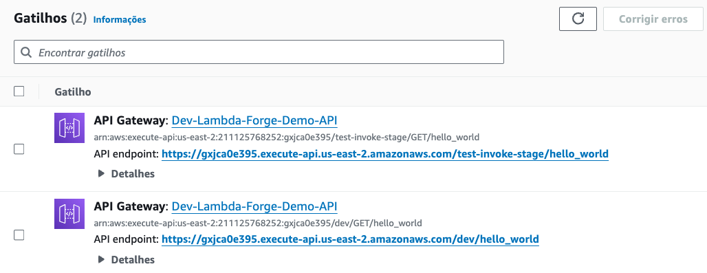

# Creating a Public Hello World Function With API Gateway

Creating a Hello World function is a great way to get started with Lambda Forge. This function will serve as a simple demonstration of Lambda Forge's ability to quickly deploy serverless functions accessible via an HTTP endpoint.

Here's how you can create your first public Hello World function.

```
forge function hello_world --method "GET" --description "A simple hello world" --public
```

This command prompts Lambda Forge to initiate a new Lambda function located in the `hello_world` directory. The `--method` parameter defines the HTTP method accessible for this function.. The `--description` option provides a concise summary of the function’s intent, and the `--public` flag ensures the function is openly accessible, allowing it to be invoked by anyone who has the URL.

## Function Structure

When you create a new function with Lambda Forge, it not only simplifies the creation process but also sets up a robust and organized file structure for your function. This structure is designed to support best practices in software development, including separation of concerns, configuration management, and testing. Let's break down the structure of the automatically generated hello_world function:

```
functions/
└── hello_world/
    ├── __init__.py
    ├── config.py
    ├── integration.py
    ├── main.py
    └── unit.py
```

- `functions/` This directory is the root folder for all your Lambda functions. Each function has its own subdirectory within this folder.
- `hello_world/` The hello_world subdirectory contains all the necessary files for your function to run, be configured, and tested.
- `config.py` Holds the configuration settings for the function. These might include environment variables, resource identifiers, and other parameters critical for the function's operation.
- `integration.py` Contains integration tests that simulate the interaction of your function with external services or resources.
- `main.py` This is where the core logic of your Lambda function resides. The handler function, which AWS Lambda invokes when the function is executed, is defined here.
- `unit.py` Contains unit tests for your function. Unit tests focus on testing individual parts of the function's code in isolation, ensuring that each component behaves as expected.


## Implementing the Hello World Function

The Lambda function's implementation should be in the `main.py` file. Below is an example showcasing our simple Hello World function:

```python title="functions/hello_world/main.py"
import json
from dataclasses import dataclass

@dataclass
class Input:
    pass

@dataclass
class Output:
    message: str

def lambda_handler(event, context):

    return {
        "statusCode": 200,
        "body": json.dumps({"message": "Hello World!"})
    }
```

The `Input` and `Output` data classes are the entrypoint for the documentation creation process. However, we will temporarily skip the docs generation details as this will be covered on a dedicated session.

Moving forward, we've successfully implemented a straightforward lambda function that outputs a basic JSON response: `{"message": "Hello World!"}`.

## The Lambda Stack Class

The Lambda Stack class handles the deployment of Lambda Functions. To deploy a function, you must instantiate its config class within the Lambda Stack class.

<div class="admonition note">
    <p class="admonition-title">Note</p>
    <p>
    When you run the <b>forge function</b> command, the config classes are automatically integrated here for you.
</p>
</div>


The Config classes require the Services Class to interact with AWS resources. Although we'll discuss AWS Services in detail later, for now, note that in the `infra/services/__init__.py` file, you'll find a Services class that acts as a factory for all AWS services.

```python title="infra/services/__init__.py" 
from infra.services.api_gateway import APIGateway
from infra.services.aws_lambda import AWSLambda

class Services:

    def __init__(self, scope, context) -> None:
        self.api_gateway = APIGateway(scope, context)
        self.aws_lambda = AWSLambda(scope, context)
```

The Lambda Stack automatically injects the Services class into the Config classes of each Lambda:


```python title="infra/stacks/lambda_stack.py" hl_lines="15"
from aws_cdk import Stack
from constructs import Construct
from infra.services import Services
from functions.hello_world.config import HelloWorldConfig


class LambdaStack(Stack):
    def __init__(self, scope: Construct, context, **kwargs) -> None:

        super().__init__(scope, f"{context.name}-Lambda-Stack", **kwargs)

        self.services = Services(self, context)

        # HelloWorld
        HelloWorldConfig(self.services)
```

## Configuring The Lambda Function

In our Lambda Forge projects, the `config.py` file plays a crucial role in defining and configuring the dependencies required by a Lambda function.


The Services class is automatically injected in the Config class of all Lambdas autoamtically by the Lambda Stack class that 
```python title="functions/hello_world/config.py"
from infra.services import Services

class HelloWorldConfig:
    def __init__(self, services: Services) -> None:

        function = services.aws_lambda.create_function(
            name="HelloWorld",
            path="./functions/hello_world",
            description="A simple hello world"
        )

        services.api_gateway.create_endpoint("GET", "/hello_world", function, public=True)
```

The Forge CLI has significantly simplified the setup by automatically tailoring the function to meet our specifications. Essentially, the `config.py` file configures a Lambda Function to be named as `HelloWorld` accompanied by the description `A simple hello world`.

Additionally, it sets up the function to respond to GET requests at the `/hello_world` path and designates it as a public endpoint, making it accessible without authentication.

## Pushing the Code to Github

With all the required settings now in place, we're ready to upload our code to the GitHub repository.

Lambda Forge is designed to support a multi-stage deployment process, automatically creating environments for Production, Staging and Development. These environments correspond to the `main`, `staging`, and `dev` branches, respectively.

For the sake of simplicity, we'll focus on deploying only the development branch at this moment, deferring the discussion on setting up a multi-stage environment to a future session.

```bash
# Initialize the Git repository
git init
git add .

# Commit the changes
git commit -m "Initial commit"

# Set the remote repository
git remote add origin git@github.com:$GITHUB_USER/$GITHUB_REPO.git

# Create, checkout, and push the 'dev' branch
git checkout -b dev
git push -u origin dev
```

## Deploying the Stacks

Deploy the Dev Stack by running the following command in your terminal:

```
forge deploy --stack Dev
```

Lambda Forge ensures that every resource it creates on AWS follows a naming convention that integrates the deployment stage, the project name, and the resource name. This approach guarantees a consistent and clear identification methodology throughout the project.

The project name is defined within the `cdk.json` file, linking each resource directly to its associated project and stage for easy management and recognition.

```json hl_lines="3" title="cdk.json"
    "region": "$AWS-REGION",
    "account": "$AWS-ACCOUNT",
    "name": "Lambda-Forge-Demo",
    "repo": {
      "owner": "$GITHUB-OWNER",
      "name": "$GITHUB-REPO"
    },
```


Following a successful deployment, a new pipeline will be created with the name `Dev-Lambda-Forge-Demo-Pipeline`. Access your AWS CodePipeline console to view it.


In a dedicated session, we'll delve into the specifics of the pipelines generated, including a closer examination of the development pipeline.

After the pipeline execution concludes, proceed to your AWS Lambda console and locate the `Dev-Lambda-Forge-Demo-HelloWorld` function.


Select the function, then navigate to `Configurations -> Triggers`. Here, you will be presented with a link to your newly deployed Lambda function, ready for use.



For this tutorial, the Lambda function is accessible via the following URL:

- [https://tbd4it3lph.execute-api.us-east-2.amazonaws.com/dev/hello_world](https://tbd4it3lph.execute-api.us-east-2.amazonaws.com/dev/hello_world)

Congratulations! 🎉 You've successfully deployed your very first Hello World function using Lambda Forge! 🚀
