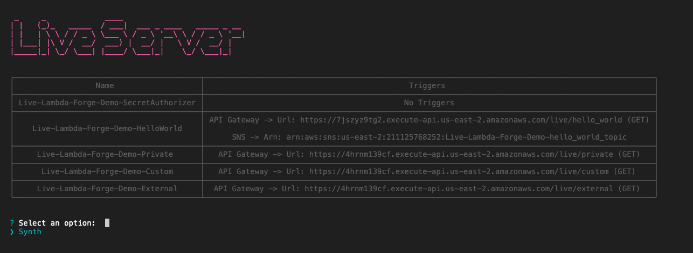

# Synchronizing Local Changes with AWS in Real-Time


Working with AWS Lambda introduces unique challenges compared to traditional server-based setups. Lambda functions are ephemeral and event-driven, terminating immediately after their tasks are completed. This nature complicates local development and testing.

To mitigate these issues, AWS developed the Serverless Application Model (SAM), which facilitates the deployment of serverless applications with YAML configurations and supports local emulation via the SAM CLI. However, SAM faces difficulties with complex applications, presents a steep learning curve, and its local testing features often fall short of replicating the complete AWS environment, potentially leading to inconsistencies.

To improve the development experience, Lambda Forge introduces a different solution. Instead of trying to locally emulate Lambda functions, Lambda Forge deploys a stub function to AWS and utilizes the [MQTT over Websockets](https://docs.aws.amazon.com/iot/latest/developerguide/protocols.html) protocol to establish a connection to a local server running on the developer's machine. This configuration proxies requests intended for the AWS Lambda function directly to the local environment, thereby facilitating an accurate replication of cloud conditions and enabling seamless local development.

## Live Server

Starting the live development server with Lambda Forge is straightforward. Execute the following command in your terminal:

```
forge live server
```

Upon executing this command, Lambda Forge will initiate a local `MQTT/Websockets` server and deploy a stub Lambda function for every Lambda defined in your Lambda Stack. These functions establish a connection with the local server, allowing requests sent to the cloud to be proxied to the developer's machine.

Lambda Forge also automatically configures triggers defined in the `functions.json` and creates a live development version for each trigger.



As illustrated in the image above, Lambda Forge sets up real AWS endpoints for live development. It also creates an SNS topic to trigger the Hello World function, which can be activated by multiple sources as previously defined in the [AWS Services](https://docs.lambda-forge.com/home/aws-services/#updating-hello-world-function-to-also-be-triggered-by-sns) documentation.

By calling these endpoints or the SNS topic, the requests sent to the cloud will be proxied to your local machine. For instance, when sending requests to the `Hello World` function and modifying its responses, you can observe live reloading during development. 


## Live Logs

During live development sessions, all events are automatically logged. To view these logs, use the following command:

```
forge live logs
```

Executing this command saves the logs and starts a live tailing process, enabling you to monitor them in real time. You can run this command in a separate terminal while the live server is running. 


<div class="admonition note">
<p class="admonition-title">Note</p>
<p>
Print statements from the Lambda functions are captured and logged as well.
</p>
</div>

<p align="center">


</p>

## Live Trigger

Unlike the API Gateway, which allows for straightforward testing via browsers or tools like Postman and Insomnia, alternative triggers such as SNS, SQS and S3 are not as readily accessible. These triggers generally necessitate the use of custom code or involve manual setup via the AWS Management Console.

To simplify the testing of these alternative triggers, Lambda Forge offers a streamlined solution. This feature allows developers to publish messages directly to the configured resources, making the testing process as simple and efficient as with API Gateway.


To trigger a service, use the following command:

```
forge live trigger
```

Executing this command initiates a session in your terminal, enabling you to publish messages directly to AWS resources such as SQS, SNS, or upload files to an S3 bucket.

<p align="center">

</p>

You can use this command to trigger your live resources seamlessly, and it can be run in different terminal tabs for a smooth live development session.


