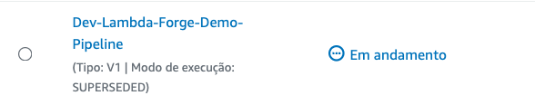

# Securing Endpoints Through an Authorizer

In this section, we will delve into securing endpoints by introducing an intermediary function known as an authorizer which will be responsible for validating incoming requests, determining if they should be allowed to access the targeted resources.

By implementing an authorizer, you can ensure that only authenticated and authorized requests are processed by your endpoints, enhancing the security and privacy of your application.

In fact, Lambda Forge treats all lambda functions as **private** by default. That's why we had to use the `--public` flag when creating the previous hello world function, to make it accessible without authentication. Without this flag, we would have been required to implement an authorizer for user authentication.

## Creating an Authorizer

First, let's begin by creating a new authorizer function with the following command:

```
forge authorizer secret --description "An authorizer to validate requests based on a secret present on the headers"
```

This command instructs the forge CLI tool to create a new authorizer under the `secret` directory.

### Authorizer Structure

Authorizers, while closely resembling Lambda Functions in structure, they fulfill a distinct role.

Let's examine the structure of an authorizer more closely:

```
authorizers
├── __init__.py
├── secret
│   ├── __init__.py
│   ├── config.py
│   ├── main.py
│   └── unit.py
└── utils
    └── __init__.py
```

- `authorizers/` This directory serves as the central hub for all authorizer functions, analogous to how the `functions/` directory houses Lambda functions. Each distinct authorizer is allocated its own subdirectory within this folder.
- `secret/` This subdirectory is specifically designed for developing the `secret` authorizer.
- `__init__.py` Marks the directory as a Python package, enabling its modules to be imported elsewhere within the project.
- `config.py` Contains the configuration settings for the authorizer, such as environmental variables and access control parameters.
- `main.py` Houses the main logic for the authorizer, detailing how incoming requests are verified.
- `unit.py` Focused on unit testing for the authorizer, these tests ensure that each part of the authorizer's code operates as expected independently.
- `utils/` Provides utility functions that are used by the authorizers, offering common functionalities or resources that can be leveraged across various authorizers.

### Implementing The Authorizer

Forge automatically generates a basic implementation of an AWS Lambda authorizer that checks for a secret value present on the headers to decide on granting or denying access.

<div class="admonition warning">
<p class="admonition-title">Warning</p>
<p> The example below is intended solely for demonstration and learning purposes and should not be used in production environemnts. It is crucial to develop a comprehensive and secure authentication mechanism suitable for your application's security needs.</p>

</div>

```python title="authorizers/secret/main.py"
def lambda_handler(event, context):

    # ATTENTION: The example provided below is strictly for demonstration purposes and should NOT be deployed in a production environment.
    # It's crucial to develop and integrate your own robust authorization mechanism tailored to your application's security requirements.
    # To utilize the example authorizer as a temporary placeholder, ensure to include the following header in your requests:

    # Header:
    # secret: CRMdDRMA4iW4xo9l38pACls7zsHYfp8T7TLXtucysb2lB5XBVFn8

    # Remember, security is paramount. This placeholder serves as a guide to help you understand the kind of information your custom authorizer should authenticate.
    # Please replace it with your secure, proprietary logic before going live. Happy coding!

    secret = event["headers"].get("secret")

    SECRET = "CRMdDRMA4iW4xo9l38pACls7zsHYfp8T7TLXtucysb2lB5XBVFn8"
    effect = "allow" if secret == SECRET else "deny"

    policy = {
        "policyDocument": {
            "Version": "2012-10-17",
            "Statement": [
                {
                    "Action": "execute-api:Invoke",
                    "Effect": effect,
                    "Resource": event["methodArn"]
                }
            ],
        },
    }
    return policy
```

The code snippet above demonstrates that the authorizer is configured to verify the presence of a header named `secret` in the request, as shown below:

`secret: CRMdDRMA4iW4xo9l38pACls7zsHYfp8T7TLXtucysb2lB5XBVFn8`

This key serves as a simple form of authentication, granting or denying access based on its presence and accuracy in the request headers.

The secret mentioned is automatically generated by Forge, meaning the specific secret you encounter during your implementation will differ from the example provided. Please be mindful of this distinction as you proceed.

### Configuring The Authorizer

Similar to lambda functions in terms of setup, authorizers diverge in their application. Instead of establishing an endpoint on API Gateway, an authorizer is configured to control access to one or more endpoints.

```python title="authorizers/secret/config.py" hl_lines="12" linenums="1"
from infra.services import Services

class SecretAuthorizerConfig:
    def __init__(self, services: Services) -> None:

        function = services.aws_lambda.create_function(
            name="SecretAuthorizer",
            path="./authorizers/secret",
            description="An authorizer to validate requests based on a secret present on the headers"
        )

        services.api_gateway.create_authorizer(function, name="secret")
```

The configuration detailed above establishes a new authorizer, assigning it a unique identifier `secret` within the API Gateway.

### Adding Authorizer To Lambda Stack

Similarly to the functions, an authorizer needs to be initialized within the `LambdaStack` class.

Fortunately, Forge takes care of this automatically.

```python title="infra/stacks/lambda_stack.py" hl_lines="18"
from aws_cdk import Stack
from constructs import Construct
from infra.services import Services
from lambda_forge import release
from authorizers.secret.config import SecretAuthorizerConfig
from functions.hello_world.config import HelloWorldConfig


@release
class LambdaStack(Stack):
    def __init__(self, scope: Construct, context, **kwargs) -> None:

        super().__init__(scope, f"{context.name}-Lambda-Stack", **kwargs)

        self.services = Services(self, context)

        # Authorizers
        SecretAuthorizerConfig(self.services)

        # HelloWorld
        HelloWorldConfig(self.services)
```

## Creating a Private Function

Now let's create a new private function.

```
forge function private --method "GET" --description "A private function"
```

Upon creating a new function using the Forge CLI, the project's function structure is expanded to include this new function alongside the existing ones.

```
functions
├── __init__.py
├── hello_world
│   ├── __init__.py
│   ├── config.py
│   ├── integration.py
│   ├── main.py
│   └── unit.py
└── private
    ├── __init__.py
    ├── config.py
    ├── integration.py
    ├── main.py
    └── unit.py
```

### Implementing the Function

This function will also output a `{"message": "Hello World!"}` message, making it identical to our existing function. The only distinction lies in its configuration.

```python title="functions/private/main.py" linenums="13" hl_lines="5"
def lambda_handler(event, context):

    return {
        "statusCode": 200,
        "body": json.dumps({"message": "Hello World!"})
    }
```

### Configuring the Function as Private

To configure the function as private, we must link it to the authorizer by passing the authorizer's name, established during its creation, to the `create_endpoint` method.

```python title="functions/private/config.py" hl_lines="12"
from infra.services import Services

class PrivateConfig:
    def __init__(self, services: Services) -> None:

        function = services.aws_lambda.create_function(
            name="Private",
            path="./functions/private",
            description="A private function",
        )

        services.api_gateway.create_endpoint("GET", "/private", function, authorizer="secret")
```

This configuration file establishes a new private function that is secured with the `secrets` authorizer and accessible via a GET request at the `/private` endpoint.

## Deployment Process for Both Authorizer and Function

As the next step, let's proceed to upload our updates to GitHub.

```bash
# Add all changes to the staging area
git add .

# Commit the staged changes with a clear message
git commit -m "Implemented a private function with an authorizer"

# Push the committed changes to the 'dev' branch
git push origin dev
```

This operation will automatically initiate our development pipeline.



After the pipeline completes successfully, the private Lambda function becomes operational:

- Dev: [https://tbd4it3lph.execute-api.us-east-2.amazonaws.com/dev/private](https://tbd4it3lph.execute-api.us-east-2.amazonaws.com/dev/private)

Direct access to these URLs through a web browser will display an unauthorized access message:

```json
{
  "Message": "User is not authorized to access this resource with an explicit deny"
}
```

However, access is granted when including the necessary secret in the request header. Below is how to use `curl` to access the Lambda function:

```
curl --request GET \
  --url https://tbd4it3lph.execute-api.us-east-2.amazonaws.com/dev/private \
  --header 'secret: CRMdDRMA4iW4xo9l38pACls7zsHYfp8T7TLXtucysb2lB5XBVFn8'
```

Upon running the curl command, you will receive the following response:

```json
{
  "message": "Hello From Private!"
}
```

This validates the functionality of our authorizer, effectively securing the private Lambda function to ensure access is only available to those possessing the correct secret header.

## Setting a Default Authorizer

Lambda Forge automatically considers all functions as private unless specified otherwise. This means functions are generally expected to require an authorizer for access control, unless they are explicitly marked as public.

To facilitate easier management and to obviate the need for specifying an authorizer for each Lambda function individually, Lambda Forge allows for the designation of a default authorizer. This default authorizer is automatically applied to all non-public Lambda functions, streamlining the configuration process for securing access.

To set an authorizer as the default, you can use the `default=True` argument in the `create_authorizer` method when defining your authorizer.

```python title="authorizers/secret/config.py" hl_lines="7" linenums="6"
        function = services.aws_lambda.create_function(
            name="SecretAuthorizer",
            path="./authorizers/secret",
            description="An authorizer to validate requests based on a secret present on the headers"
        )

        services.api_gateway.create_authorizer(function, name="secret", default=True)
```

Next, we'll update the Private Function configuration to no longer directly associate it with the `secrets` authorizer.

```python title="functions/private/config.py" hl_lines="7" linenums="6"
        function = services.aws_lambda.create_function(
            name="Private",
            path="./functions/private",
            description="A private function",
        )

        services.api_gateway.create_endpoint("GET", "/private", function)
```

Having designated the `secret `authorizer as the default, any function not explicitly linked to a particular authorizer and not flagged as public, such as this one, will inherently be protected by the `secret` authorizer by default.
