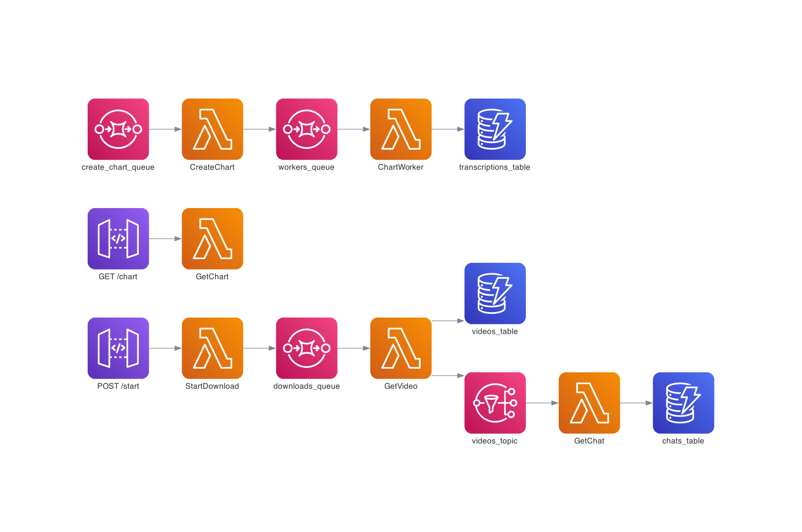
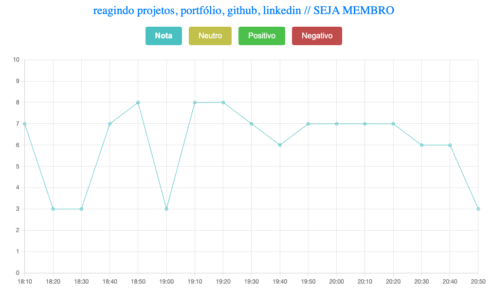
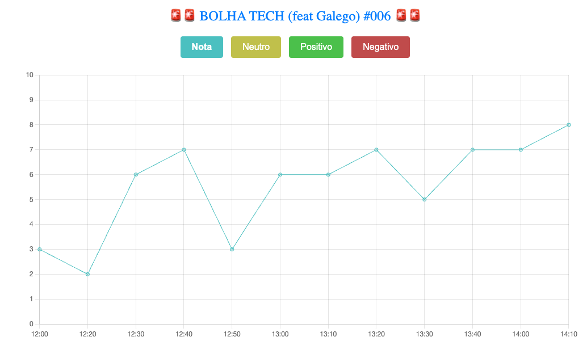
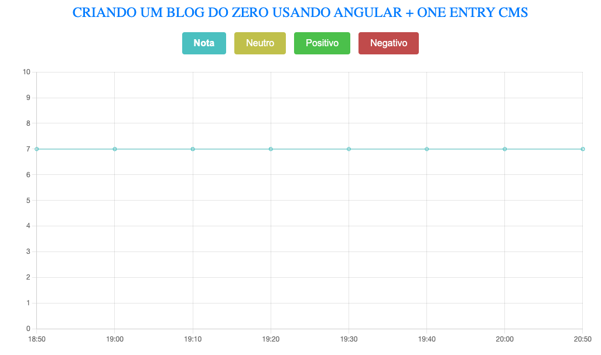
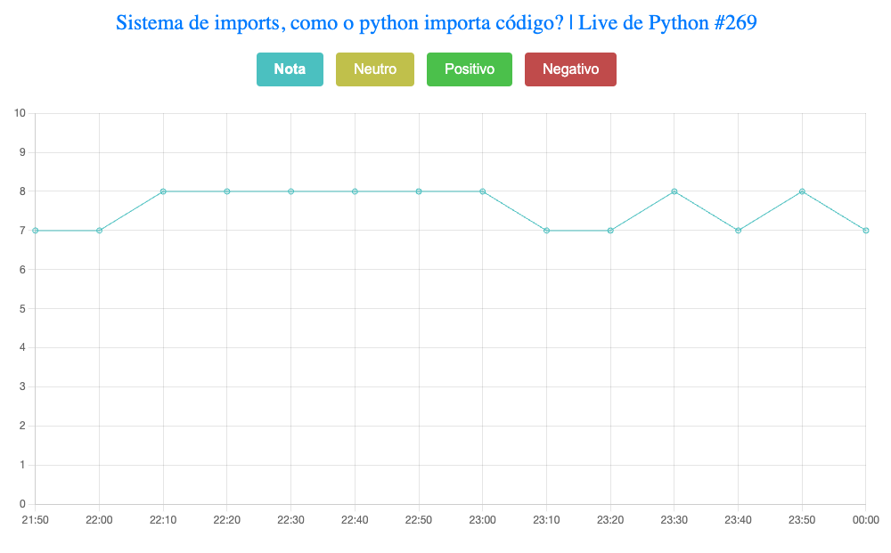

# Youtube Live Insights With Sentiment Analysis

This project is the MVP of a SaaS that utilizes Large Language Models (LLMs) to measure and analyze engagement levels in YouTube live streams. By focusing on interactions within the live chat, it identifies key moments in the video that can be transformed into engaging, shorter clips for YouTube.

**Note**: The evaluation may vary based on the context provided to the LLM about the YouTuber in the prompt.

It's a serverless project deployed on AWS using [Lambda Forge](https://github.com/GuiPimenta-Dev/lambda-forge).

# Diagram

The diagram below showcases the project's architecture. It was created using the command:

```
forge diagram
```

This command provides a visual representation of the entire system's structure, highlighting key components and their interactions.

<div align="center">
  
</div>

# API Documentation

The project includes comprehensive documentation for all available endpoints, ensuring ease of use and clarity for developers. This documentation is accessible via Swagger and Redoc interfaces, both automatically generated by Lambda Forge. It includes detailed descriptions, request and response formats, and examples for each endpoint, providing developers with clear and concise information.

- [Swagger](https://8haasqop5b.execute-api.us-east-2.amazonaws.com/prod/swagger)
- [Redoc](https://8haasqop5b.execute-api.us-east-2.amazonaws.com/prod/redoc)


# Live Stream Analysys

In this section, we analyze the chat interactions from a few Brazilian YouTubers.


## Mano Deyvin

In the video below, Mano Deyvin reacts to various projects and portfolios submitted by his subscribers, including Lambda Forge at the 2:28 mark.

<div align="center">

[reagindo projetos, portfólio, github, linkedin // SEJA MEMBRO](https://www.youtube.com/watch?v=5Zw0taVl2l0)


</div>

Using Large Language Models (LLMs), we have broken down the chat engagement of this live stream into 10-minute intervals. Below, you can find a detailed analysis of the chat interactions during this specific live stream.

The prompt used to generate the chart was:

```
Mano Deyvin is a Brazilian Youtuber that talks about tech stuff. His channel is very focused on humor and on this specific video he is reacting to linkedins, portfolios and projects sent by his subscribers.
```

<div align="center">

[https://8haasqop5b.execute-api.us-east-2.amazonaws.com/prod/chart?video_id=f498ab20-4929-4f89-a4b3-a400fc7c4d82](https://8haasqop5b.execute-api.us-east-2.amazonaws.com/prod/chart?video_id=f498ab20-4929-4f89-a4b3-a400fc7c4d82)



</div>

## Lucas Montano

Lucas Montano is a Brazilian Youtuber that talks about the tech market in general.

<div align="center">

[🚨🚨 BOLHA TECH (feat Galego) #006 🚨🚨](https://www.youtube.com/watch?v=1nQRYmLgon4)


</div>

The prompt used to generate the analysis was:

```
Lucas Montano is a Brazilian Youtuber that talk about the tech market in general. In this video he is focusing on the tech market with AI.
```

You can access the chat interaction analysis via the link below.

<div align="center">

[https://8haasqop5b.execute-api.us-east-2.amazonaws.com/prod/chart?video_id=967e823f-3c24-4f2c-9fde-00932fa09fd6](https://8haasqop5b.execute-api.us-east-2.amazonaws.com/prod/chart?video_id=967e823f-3c24-4f2c-9fde-00932fa09fd6)


</div>


## Fernanda Kipper

In the video below, Fernanda Kipper teaches how to recreate the Medium with Angular from scratch.

<div align="center">

[CRIANDO UM BLOG DO ZERO USANDO ANGULAR + ONE ENTRY CMS](https://www.youtube.com/watch?v=9HQiTFZz0Gg)


</div>

The prompt used to create the chart was:

```
Fernanda Kipper is a Brazilian YouTuber who runs a channel dedicated to teaching various frameworks and programming languages. She also conducts live coding sessions. In this particular live stream, she teaches how to recreate the Medium with Angular.
```

The analysis for the chat interactions can be found in the link below.

<div align="center">

[https://8haasqop5b.execute-api.us-east-2.amazonaws.com/prod/chart?video_id=973e44cb-4fc2-43b2-b4d5-5056586714db](https://8haasqop5b.execute-api.us-east-2.amazonaws.com/prod/chart?video_id=973e44cb-4fc2-43b2-b4d5-5056586714db)


</div>


## Eduardo Mendes

Eduardo Mendes has a channel on Youtube to teach Python to its subscribers. In the video below, he teaches how the imports system works in Python.

<div align="center">

[Sistema de imports, como o python importa código? | Live de Python #269](https://www.youtube.com/watch?v=a5R5dvim6TQ)


</div>

The prompt used to generate this chart was:

```
Eduardo Mendes is a Brazilian Youtuber that has a channel focused on teaching Python. In this specific live he teaches about how the imports system works in Python.
```

The analysis for the chat interactions can be found in the link below.

<div align="center">

[https://8haasqop5b.execute-api.us-east-2.amazonaws.com/prod/chart?video_id=0c103613-01bd-4363-89e3-094b94f3353c](https://8haasqop5b.execute-api.us-east-2.amazonaws.com/prod/chart?video_id=0c103613-01bd-4363-89e3-094b94f3353c)



</div>