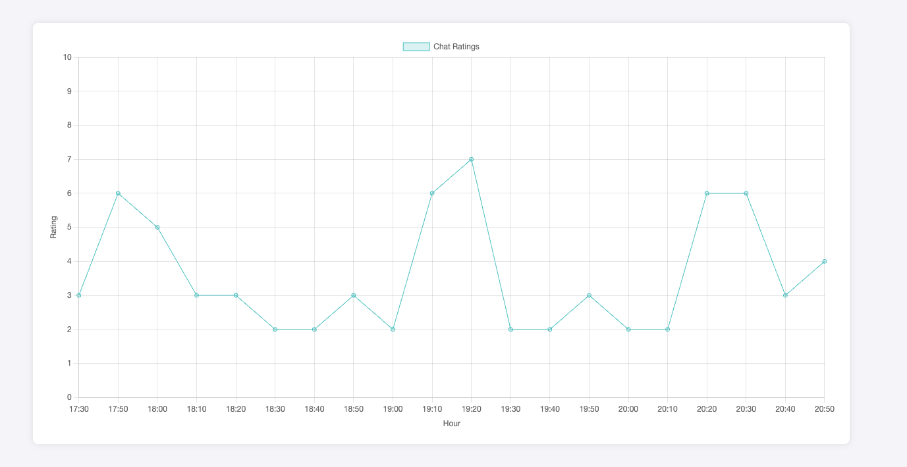
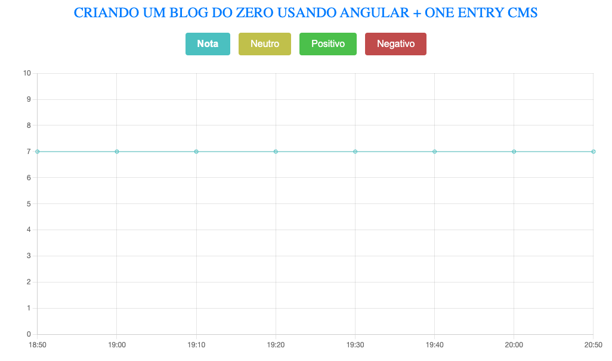
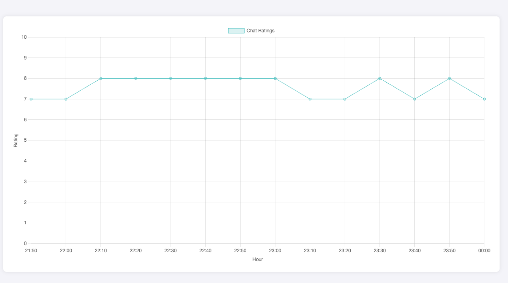

# Youtube Live Insights

This project is the MVP of a SaaS that utilizes Large Language Models (LLMs) to measure and analyze engagement levels in YouTube live streams. By focusing on interactions within the live chat, it identifies key moments in the video that can be transformed into engaging, shorter clips for YouTube.

It's a serverless project deployed on AWS using [Lambda Forge](https://github.com/GuiPimenta-Dev/lambda-forge).

# Diagram

The diagram below showcases the project's architecture. It was created using the command:

```
forge diagram
```

This command provides a visual representation of the entire system's structure, highlighting key components and their interactions.

<div align="center">


</div>

# API Documentation

The project includes comprehensive documentation for all available endpoints, ensuring ease of use and clarity for developers. This documentation is accessible via Swagger and Redoc interfaces, both automatically generated by Lambda Forge. It includes detailed descriptions, request and response formats, and examples for each endpoint, providing developers with clear and concise information.

- [Swagger](https://8haasqop5b.execute-api.us-east-2.amazonaws.com/prod/swagger)
- [Redoc](https://8haasqop5b.execute-api.us-east-2.amazonaws.com/prod/redoc)


# Live Stream Analysys

In this section, we analyze the chat interactions from a few Brazilian YouTubers.


## Mano Deyvin

In the video below, Mano Deyvin reacts to various projects and portfolios submitted by his subscribers, including Lambda Forge at the 2:28 mark.

<div align="center">

[reagindo projetos, portfólio, github, linkedin // SEJA MEMBRO](https://www.youtube.com/watch?v=5Zw0taVl2l0)


</div>

Using Large Language Models (LLMs), we have broken down the chat engagement of this live stream into 10-minute intervals. Below, you can find a detailed analysis of the chat interactions during this specific live stream.

<div align="center">

[https://8haasqop5b.execute-api.us-east-2.amazonaws.com/prod/chart?video_id=559484e7-09b8-4dc7-a55c-cc4e0e810814](https://8haasqop5b.execute-api.us-east-2.amazonaws.com/prod/chart?video_id=559484e7-09b8-4dc7-a55c-cc4e0e810814)



</div>


## Fernanda Kipper

In the video below, Fernanda Kipper teaches how to recreate the Medium with Angular from scratch.

<div align="center">

[CRIANDO UM BLOG DO ZERO USANDO ANGULAR + ONE ENTRY CMS](https://www.youtube.com/watch?v=9HQiTFZz0Gg)


</div>

The analysis for the chat interactions can be found in the link below.

<div align="center">

[https://8haasqop5b.execute-api.us-east-2.amazonaws.com/prod/chart?video_id=e4c06bad-5f31-4678-8d17-95770390b192](https://8haasqop5b.execute-api.us-east-2.amazonaws.com/prod/chart?video_id=e4c06bad-5f31-4678-8d17-95770390b192)
</div>



## Eduardo Mendes

In the video below, Eduardo Mendes teaches how the imports system works in Python.

<div align="center">

[Sistema de imports, como o python importa código? | Live de Python #269](https://www.youtube.com/watch?v=a5R5dvim6TQ)


</div>

The analysis for the chat interactions can be found in the link below.

<div align="center">

[https://8haasqop5b.execute-api.us-east-2.amazonaws.com/prod/chart?video_id=0789152f-ba55-4c7b-8e29-bd77124c9ca8](https://8haasqop5b.execute-api.us-east-2.amazonaws.com/prod/chart?video_id=0789152f-ba55-4c7b-8e29-bd77124c9ca8)



</div>