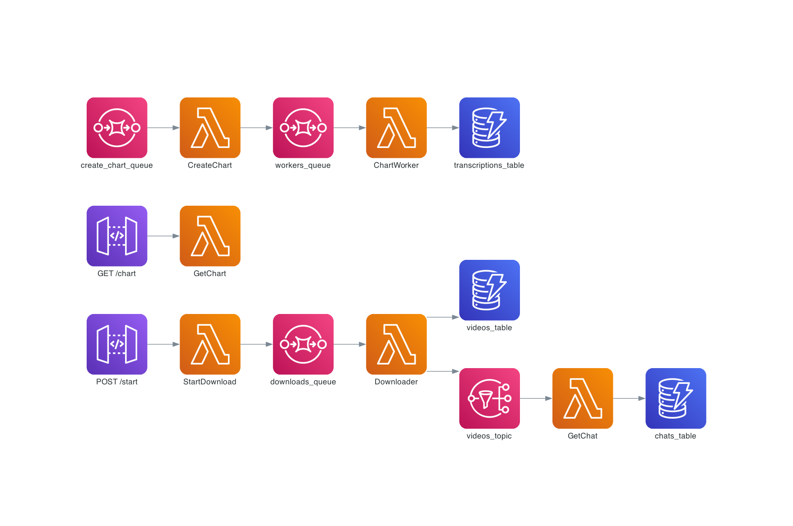

# Youtube Live Insights

This project aims to measure and analyze the level of engagement in YouTube live streams, focusing specifically on interactions within the live chat.

## Architecture Diagram

# live-insights
<!-- 
{
    "video_id": "559484e7-09b8-4dc7-a55c-cc4e0e810814",
    "interval": 10,
    "prompt": "Mano Deyvin is a brazilian YouTuber who talks about programming and technical careers in general. His channel has a stronger focus on humor, and in this specific video, he is reacting to projects, LinkedIn profiles, and portfolios sent by subscribers.",
} -->

<!-- {
    "video_id": "559484e7-09b8-4dc7-a55c-cc4e0e810814",
    "interval": 10,
    "min_messages": 5,
    "prompt": "Fernanda Kipper is a Brazilian content creator known for her insightful and educational videos on technology and programming. With a strong background in software development, she shares tutorials, tips, and career advice, helping her audience navigate the tech industry. Fernanda's channel is appreciated for its clear and approachable style, making complex topics accessible to beginners and experienced developers alike."
} -->

<!-- {
    "video_id": "0789152f-ba55-4c7b-8e29-bd77124c9ca8",
    "interval": 10,
    "min_messages": 5,
    "prompt": "Eduardo Mendes is a well-known Brazilian software developer and content creator who shares educational videos on Python and technology. His channel offers clear tutorials, practical insights, and career advice, making complex topics accessible to all skill levels."
}  -->

